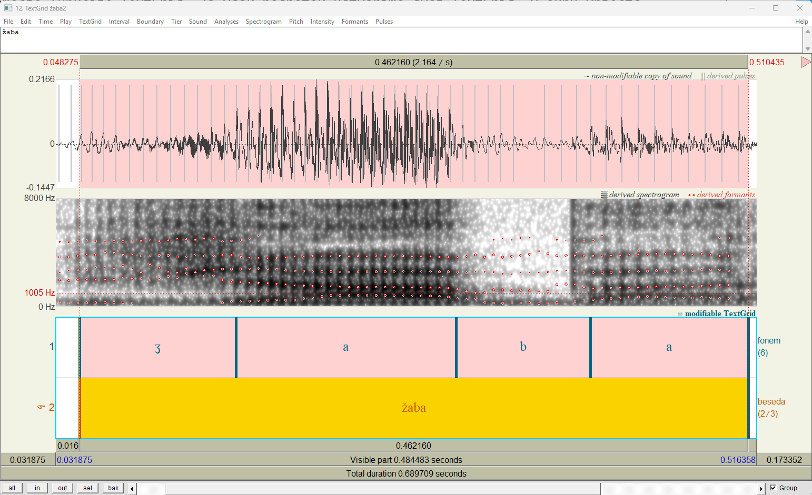
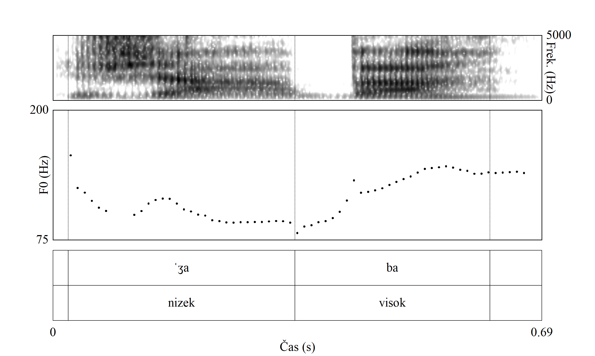

```{r}
#| label: setup
#| include: false

library(readxl)
library(phonR)
library(readr)

Data <- read_excel("Samoglasniki-obdobja-2026.xlsx")

Data <- subset(Data, oznaka %in% c("f1", "f2", "m1", "m2"))

DataNPM <- read_delim(
  "DataPredsedniskeVolitveBrezOsamelcev.csv",
  delim = ";",
  locale = locale(decimal_mark = ".")
)

DataNPMA <- subset(DataNPM, Merilec %in% c("A"))
DataNPMB <- subset(DataNPM, Merilec %in% c("B"))
DataNPMC <- subset(DataNPM, Merilec %in% c("C"))
DataNPMČ <- subset(DataNPM, Merilec %in% c("Č"))
DataNPMD <- subset(DataNPM, Merilec %in% c("D"))

```


---
title: "Uporaba računalniškega programa Praat pri poučevanju akustične fonetike"
author: "asist. dr. Luka Horjak"
institute: "Univerza v Ljubljani, Filozofska fakulteta, Oddelek za slovenistiko"
lang: sl
date: ""

bibliography: references.bib
csl: apa.csl

format:
  revealjs:
    theme: default
    slide-number: true
    progress: true
    transition: fade
    incremental: false
    smaller: true
    chalkboard: false
    preview-links: auto
    css: styles.css

---

## Izhodišče

![Formanti /i - a - u/, @toporisic_slovenska_2000 [str.91]](slike\formanti2-Toporišič-2000-91.png){width="100%"}

## Izhodišče

![Formanti (shema), @toporisic_slovenska_2000 [str.49]](slike\formanti-Toporišič-2000-49.png){width="100%"}


## Praat (1992--)

:::: {.columns}

::: {.column width="30%"}

- niz. *govoriti*
- brezplačen, odprtokoden program
- analiza zvočnega signala (fonetika, fonologija)
- Inštitut za fonetiko Univerze v Amsterdamu
- Paul Boersma in David Weenink 
- 6.4.67 (21. maj 2026, @boersma_praat_2026)

:::

::: {.column width="70%"}

{width="100%"}

:::

::::


## Uporaba v pedagoške namene

:::: {.columns}

::: {.column width="50%"}
- **Vaje pri predmetih** (FF UL, Oddelek za slovenistiko):
  - Govorna tehnika
  - Besedilna fonetika SKJ
- **Cilja**: 
  - razumevanje abstraktnih pojavov
  - samostojna analiza, raziskovanje
:::
::: {.column width="50%"}
- **Možnosti**:
  - formantna struktura (F~1~--F~4~)
  - trajanje zvočnih pojavov
  - intonacija, tonemski naglas, register
  - jakost
  - čas do začetka zvenečnosti (angl. VOT)

:::
::::
## Formanti samoglasnikov

- Kaj je **formant**? 

> [J]akostno okrepljeno področje harmoničnih (ali drugačnih) tonov ali slušne energije na značilnem frekvenčnem področju posameznih (vrst) glasov. Zlasti izrazite ožjepasovne formante imajo samoglasniki, manj izrazite zvočniki, širše formantno področje pa nezvočniki. [@toporisic_enciklopedija_1992, str. 44–45.]

- @kent_acoustic_2002 [str. 24]: naravni način vibracije (resonance) govorne cevi; formantna frekvenca in pasovna širina.
- F~1~: sorazmeren z odprtostjo samoglasnika; obratno sorazmeren z višino 
- F~2~: sorazmeren s sprednostjo samoglasnika [@weckwerth_vowels_2022; @kent_acoustic_2002; @pompino-marschall_einfuhrung_2009; @liker_koartikulacija_2024; @petursson_elementarbuch_2002]

## Formantni samoglasnikov: slovenščina

Dosedanje raziskave:

- @lehiste_phonemes_1961
- @toporisic_formanti_1975 → *Slovenska slovnica* (1976--2004)
- @petek_acoustic_1996 → *International Phonetic Association*
- Ozbič [-@ozbic_akusticna_1998; -@ozbic_razmerja_1998] in @skubic_samoglasniki_2018
- Tivadar [-@tivadar_govorjena_2003; -@tivadar_foneticno-fonoloske_2004; -@tivadar_kakovost_2008; -@tivadar_normativni_2010]
- Jurgec [-@jurgec_formant_2005; -@jurgec_formantne_2006] 
- @varosanec-skaric_comparison_2017, @varosanec-skaric_forenzicna_2019

## Prvi eksperiment: Meritve svojih samoglasnikov

:::: {.columns}

::: {.column width="50%"}

- naglašeni samoglasniki
- snemanje v studiu FF UL
- branje povedi, ca. 20--30 min
- samostojne meritve (F~1~ in F~2~)
- izdelava izrisov v R (paket *phonR*; @mccloy_phonr_2016)
- pretvorba iz Hz v Barkovo lestvico

$$
\mathrm{Bark} = \frac{26.81 \cdot f}{1960 + f} - 0.53
$$

:::

::: {.column width="50%"}

- Skala preslika mesto frekvence na bazilarno membrano, ki je dolga ca. 32 mm in ima dva in pol zavoja. Različna mesta na membrani vibrirajo z različno frekvenco (20–20.000 Hz) [@yang_measuring_2022; @johnson_acoustic_2012].

```{r}
#| echo: false
#| fig-width: 6
#| fig-height: 4
#| out-width: "100%"

f <- seq(0, 5000, by = 10)
bark <- (26.81 * f) / (1960 + f) - 0.53

plot(
  f, bark,
  type = "l",
  lwd = 2,
  xlab = "Frekvenca (Hz)",
  ylab = "Bark",
  main = ""
)
```
:::

::::

## Analiza samoglasnikov (F~1~ x F~2~) študentov

```{r}
#| echo: false
#| warning: false
#| message: false
#| fig-width: 10
#| fig-height: 5
#| out-width: "95%"
#| fig-cap: "**Levo**: vrednosti formantov v Hz; **desno**: vrednost formantov v Bark."

par(mfrow = c(1, 2))
with(Data, plotVowels(F1, F2, Samoglasnik, group = oznaka, var.col.by = oznaka, var.sty.by = oznaka, plot.tokens = FALSE, plot.means = TRUE, pch.means = Samoglasnik,cex.means = 2, pretty = TRUE, 
    poly.line = TRUE, poly.order = c("i", "e", "ɛ", "a", "ɔ", "o", "u"),legend.kwd = "bottomleft", 
    legend.args = list(seg.len = 3, cex = 1.2, lwd = 2), col = c("#DD5129FF", "#0F7BA2FF", "#43B284FF", "#FAB255FF"), lty = c("solid", "solid", "solid", "solid"), xlim = c(2500, 600), 
    ylim = c(950, 200), main   = ""))
with(Data, plotVowels(F1Bark, F2Bark, Samoglasnik, group = oznaka, var.col.by = oznaka, var.sty.by = oznaka, plot.tokens = FALSE, plot.means = TRUE, pch.means = Samoglasnik,cex.means = 2, pretty = TRUE, 
    poly.line = TRUE, poly.order = c("i", "e", "ɛ", "a", "ɔ", "o", "u"),legend.kwd = "bottomleft", 
    legend.args = list(seg.len = 3, cex = 1.2, lwd = 2), col = c("#DD5129FF", "#0F7BA2FF", "#43B284FF", "#FAB255FF"), lty = c("solid", "solid", "solid", "solid"), xlim = c(15, 5), 
    ylim = c(9, 2), main   = ""))
```

## Analiza samoglasnikov (F~1~ x F~2~) predsednice države I.

:::: {.columns}

::: {.column width="50%"}
- Analiza samoglasnikov predsednice države
- Gradivo: posnetek predvolilnega soočenja (RTV SLO, 20. 10. 2022), ca. 6 min
- Meritev F~1~ in F~2~, pretvorba v Bark skalo
- Odstranitev osamelcev: 
$$
z = \frac{f - \mu}{\sigma}, \qquad |z| \geq 3
\quad \text{za } \operatorname{F}_1 \text{ in } \operatorname{F}_2
$$
($f$ -- frekvenca formanta; $\mu$ -- populacijsko povprečje; $\sigma$ -- populacijski standardni odklon)
:::

::: {.column width="50%"}
```{r}
#| echo: false
#| warning: false
#| message: false
#| fig-width: 5
#| fig-height: 5
#| out-width: "95%"
#| fig-cap: "Prikaz meritev samoglasnikov predsednice države."

with(DataNPM, plotVowels(
  f1Bark, f2Bark, vowel,
  group = subject,
  var.col.by = vowel,
  plot.tokens = TRUE,
  plot.means = TRUE,
  pch.means = vowel,
  pch.tokens = vowel,
  cex.means = 3,
  cex.tokens = 1.5,
  alpha.tokens = 0.1,
  pretty = TRUE,
  poly.line = TRUE,
  col = c("#0C59FEFF", "#15E0FAFF", "#FEC700FF", "#FB7200FF",
          "#FC0F00FF", "#43B284FF", "#DD5129FF"),
  poly.order = c("i", "e", "ɛ", "a", "ɔ", "o", "u"),
  xlim = c(17, 5),
  ylim = c(9, 2),
  main = ""
))
```
:::
::::

## Analiza samoglasnikov (F~1~ x F~2~) predsednice države II.

```{r}
#| echo: false
#| warning: false
#| message: false
#| fig-cap: "Prikaz meritev samoglasnikov predsednice države za vse merilce."
par(mfrow = c(2, 3))
with(DataNPMA, plotVowels(f1Bark, f2Bark, vowel, group = subject, var.col.by = vowel, var.sty.by = subject, plot.tokens = TRUE, plot.means = TRUE, pch.means = vowel, pch.tokens = vowel, cex.means = 4, cex.tokens = 2, alpha.tokens = 0.3, pretty = TRUE, 
    poly.line = TRUE, poly.order = c("i", "e", "ɛ", "a", "ɔ", "o", "u"),
    legend.args = list(seg.len = 3, cex = 1.2, lwd = 2), col = c("#0C59FEFF"), lty = c("solid"), main   = "A", xlim = c(17, 5),
    ylim = c(9, 2)))
with(DataNPMB, plotVowels(f1Bark, f2Bark, vowel, group = subject, var.col.by = vowel, var.sty.by = subject, plot.tokens = TRUE, plot.means = TRUE, pch.means = vowel,cex.means = 4, cex.tokens = 2, alpha.tokens = 0.3, pretty = TRUE, pch.tokens = vowel, 
    poly.line = TRUE, poly.order = c("i", "e", "ɛ", "a", "ɔ", "o", "u"),
    legend.args = list(seg.len = 3, cex = 1.2, lwd = 2), col = c("#15E0FAFF"), lty = c("solid"), main   = "B", xlim = c(17, 5),  ylim = c(9, 2)))
with(DataNPMC, plotVowels(f1Bark, f2Bark, vowel, group = subject, var.col.by = vowel, var.sty.by = subject, plot.tokens = TRUE, plot.means = TRUE, pch.means = vowel,cex.means = 4, cex.tokens = 2, alpha.tokens = 0.3, pretty = TRUE, pch.tokens = vowel,
    poly.line = TRUE, poly.order = c("i", "e", "ɛ", "a", "ɔ", "o", "u"),
    legend.args = list(seg.len = 3, cex = 1.2, lwd = 2), col = c("#FEC700FF"), lty = c("solid"), main   = "C", xlim = c(17, 5), ylim = c(9, 2)))
with(DataNPMČ, plotVowels(f1Bark, f2Bark, vowel, group = subject, var.col.by = vowel, var.sty.by = subject, plot.tokens = TRUE, plot.means = TRUE, pch.means = vowel,cex.means = 4, cex.tokens = 2, alpha.tokens = 0.3, pretty = TRUE, pch.tokens = vowel,
    poly.line = TRUE, poly.order = c("i", "e", "ɛ", "a", "ɔ", "o", "u"), legend.args = list(seg.len = 3, cex = 1.2, lwd = 2), col = c("#FB7200FF"), lty = c("solid"), main   = "Č", xlim = c(17, 5), ylim = c(9, 2)))
with(DataNPMD, plotVowels(f1Bark, f2Bark, vowel, group = subject, var.col.by = vowel, var.sty.by = subject, plot.tokens = TRUE, plot.means = TRUE, pch.means = vowel,cex.means = 4, cex.tokens = 2, alpha.tokens = 0.3, pretty = TRUE, pch.tokens = vowel, poly.line = TRUE, poly.order = c("i", "e", "ɛ", "a", "ɔ", "o", "u"), legend.args = list(seg.len = 3, cex = 1.2, lwd = 2), col = c("#FC0F00FF"), lty = c("solid"), main   = "D", xlim = c(17, 5), ylim = c(9, 2)))
```
## Analiza samoglasnikov (F~1~ x F~2~) predsednice države III.

:::: {.columns}

::: {.column width="50%"}
- skupaj 970 meritev

| Št. | n | F1 | SD | F2 | SD |
|-----|--:|---:|---:|---:|---:|
| A | 12 | 5,23 | 0,93 | 8,47 | 2,18 |
| B | 23 | 5,45 | 0,81 | 8,99 | 2,17 |
| C | 13 | 5,34 | 0,33 | 9,71 | 1,68 |
| Č | 28 | 5,22 | 0,50 | 7,97 | 0,79 |
| D | 44 | 5,51 | 0,69 | 9,13 | 2,75 |
*Opomba*. Samoglasnik /<span style="color:#DD5129FF;">o</span>/
 (vrednosti v Bark).
:::

::: {.column width="50%"}
```{r}
#| echo: false
#| warning: false
#| message: false
#| fig-width: 5
#| fig-height: 5
#| out-width: "95%"
#| fig-cap: "Prekrivnost povprečij posameznih merilcev."

with(DataNPM, plotVowels(
  f1Bark, f2Bark, vowel,
  group = Merilec,
  var.col.by = vowel,
  plot.tokens = TRUE,
  plot.means = TRUE,
  pch.means = vowel,
  pch.tokens = vowel,
  cex.means = 3,
  cex.tokens = 1.5,
  alpha.tokens = 0.1,
  pretty = TRUE,
  poly.line = TRUE,
  poly.order = c("i", "e", "ɛ", "a", "ɔ", "o", "u"),
  col = c("#0C59FEFF", "#15E0FAFF", "#FEC700FF", "#FB7200FF",
          "#FC0F00FF", "#43B284FF", "#DD5129FF"),
  xlim = c(17, 5),
  ylim = c(9, 2),
  main = ""
))
```
:::
::::

## Tonemski naglas 

- Raziskave: Srebot-Rejec [-@srebot-rejec_o_2000; -@srebot-rejec_ali_2000], @sustarsic_perception_2005
- tretja izdaja *Slovarja slovenskega knjižnega jezika* (eSSKJ)
- iztočnice na črko ⟨ž⟩ (npr. *žaba*, *železobetonski*, *žlampati*), stanje: 10. 11. 2020 
- namen: 
  - preveriti usklajenost opisa s posnetkom
  - prepoznavanje narave tonskih potekov (\*L+H, \*H+L)

## Tonemski naglas: prikaz I.

{width="80%"}

## Tonemski naglas: prikaz II.
{width="80%"}

## Zaključek
- Uporaba Praata pri pouku akustičnofonetičnih vsebin omogoča:
  - razumevanje povezave med akustičnimi lastnostmi samoglasnikov in položajem jezika v ustni votlini
  - razumevanje fonetičnih in fonoloških terminov
  - analizo realnega govora
  - vizualno prepoznavo pojavov (npr. tonskega poteka)

# Hvala za pozornost

[Luka.Horjak@ff.uni-lj.si](Luka.Horjak@ff.uni-lj.si)

## Literatura

::: {#refs}
:::